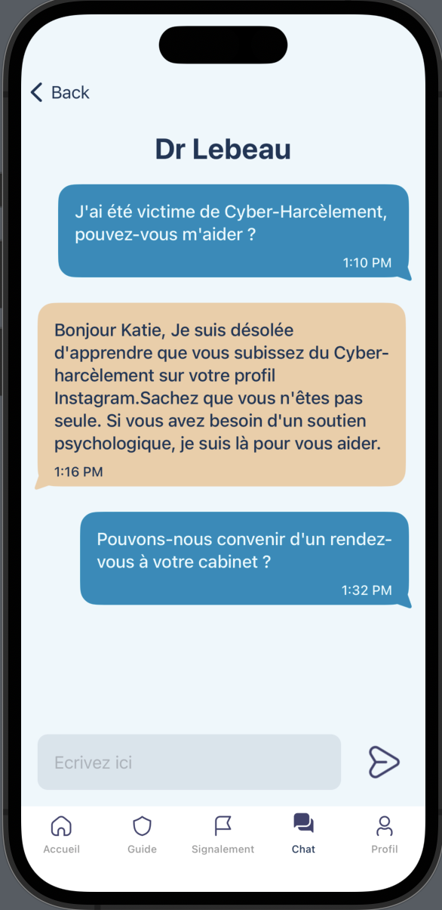

# Cyberhelp

## Projet

Cyberhelp est une plateforme qui permet de signaler des actes de cyberharcèlement, de témoigner et de mettre en contact les personnes touchées par le cyberharcèlement avec des professionnels de la santé.
Cette application est le résultat d'un projet d'école réalisé en 10 jours (idée, étude de marché, wireframe, backlog, maquettage et développement)

### Qu'est ce que le cyberharcèlement ?

C'est l'utilisation des technologies de l'information et de la communication pour intimider, harceler, menacer ou ridiculiser une personne ou un groupe de personnes.

### Qui en sont les cibles ?

- 84% sont des femmes,
- 43% sont des persones LGBT,
- 22% sont des personnes handicapées,
- 51% ont moins de 30 ans.

### Les solutions apportées

Cyberhelp permet aux personnes touchées par le cyberharcèlement de signaler leur besoin de parler et permet d'être mis en contact et chatter rapidement avec un professionnel de santé. L'utilisateur peut aussi témoigner anonymement de son expérience.

## Fonctionalités

### L'interface utilisateur

- Page d'accueil : Permet de s'informer sur les actualités autour du cyberharcèlement, de consulter les événements autour de chez soi sur le sujet et consulter ou soumettre un témoignage sur le réseau.
- Guide : c'est un manuel de marche à suivre afin de prévenir et se protéger du cyberharcèlement
- Signalement : page permettant d'envoyer une signalement de cyberharcèlement qui sera traité par un professionnel de santé type psychologue
- Chat : interface de discussion entre utilisateur et professionnel de santé
- Profil : affiche tous les détails et posts de l'utilisateur

### Exemple de pages

  

  

 
